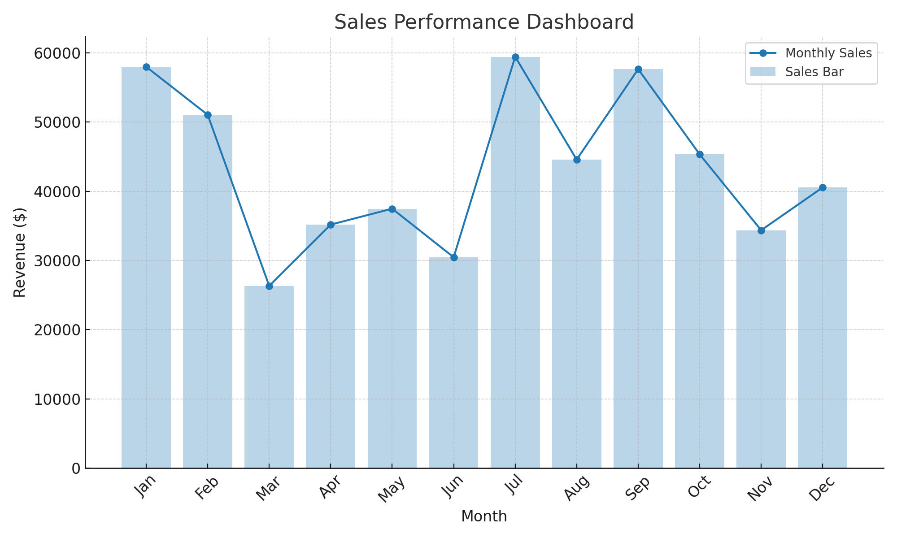
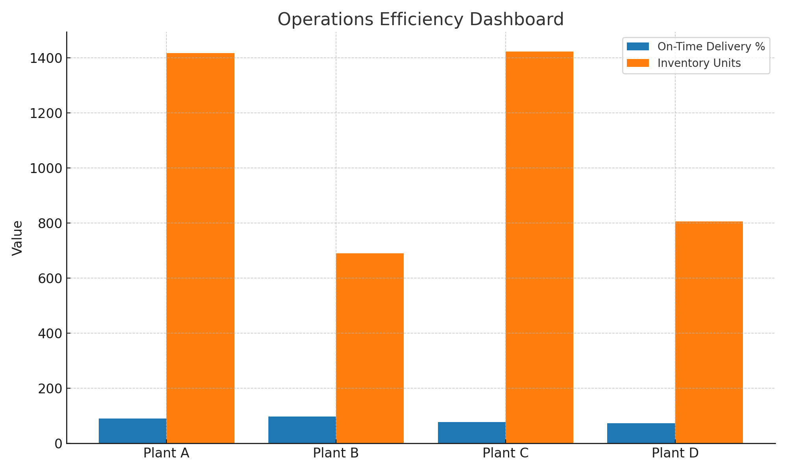
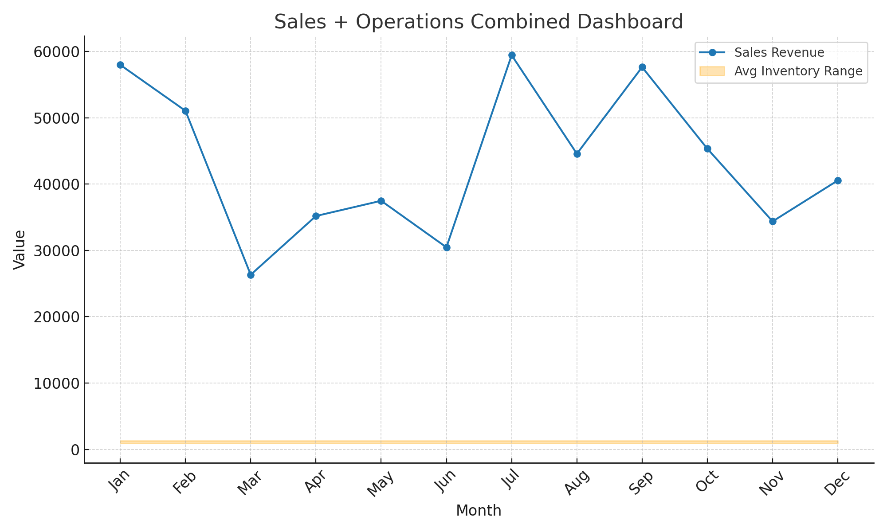

# 📊 Sales & Operations Performance Dashboard

## 📌 Project Overview  
This project showcases a **Sales & Operations Performance Dashboard** built using **SQL, Excel, and Tableau**.  
It integrates sales and operations datasets to provide insights into KPIs, trends, and efficiency across multiple regions.  

The goal of this project is to **enable data-driven decisions** by visualizing performance metrics, reducing manual reporting, and improving cross-team collaboration.  

---

## 🛠️ Tools & Technologies  
- **SQL** → Data extraction and cleaning  
- **Excel** → Data preprocessing, Pivot Tables, and Reporting  
- **Tableau** → Interactive dashboards and KPI visualizations  
- **Python (Matplotlib, Pandas)** → Generating sample visualizations for GitHub showcase  

---

## 📂 Project Structure  
├── data/ # Sample datasets (anonymized / dummy data)
├── dashboards/ # Dashboard images (PNG files)
│ ├── sales_dashboard.png
│ ├── efficiency_dashboard.png
│ └── combined_dashboard.png
├── scripts/ # SQL queries, Excel files, and Python scripts
│ ├── queries.sql
│ ├── dashboard_excel.xlsx
│ └── visualization.py
└── README.md # Project documentation

---

## 📈 Dashboards  

### 🔹 Sales Dashboard  
  

### 🔹 Operational Efficiency Dashboard  
  

### 🔹 Combined Sales & Operations Dashboard  
  

---

## 📊 SQL Queries Example  
```sql
-- Total Sales by Region
SELECT region, SUM(sales_amount) AS total_sales
FROM sales_data
GROUP BY region
ORDER BY total_sales DESC;

-- Operations Efficiency
SELECT region, 
       (SUM(successful_ops) * 100.0 / SUM(total_ops)) AS efficiency
FROM operations_data
GROUP BY region;
